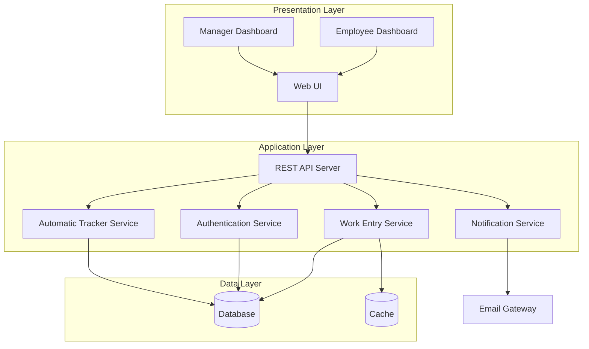

# Design Document: Employee Work Tracker

## Overview

The Employee Work Tracker is a web-based application that enables employees to record their daily work activities and allows managers to monitor work completion across their team. The system supports both manual work entry and automatic activity tracking, providing comprehensive visibility into employee productivity without requiring constant manual follow-ups.

### Key Design Goals

1. **Simplicity**: Provide an intuitive interface for employees to quickly log their work
2. **Visibility**: Give managers real-time and historical insights into team productivity
3. **Flexibility**: Support both manual and automatic work tracking modes
4. **Security**: Ensure proper authentication and authorization for all operations
5. **Data Integrity**: Validate all inputs and maintain accurate work records

### System Boundaries

**In Scope:**
- Web-based user interface for employees and managers
- RESTful API for work entry management
- Database for persistent work log storage
- Authentication and authorization system
- Email notification service
- Automatic work tracking component

**Out of Scope:**
- Mobile native applications (web responsive design only)
- Integration with external project management tools
- Payroll or time-sheet integration
- Advanced analytics and reporting beyond basic metrics

## Architecture

### High-Level Architecture

The system follows a three-tier architecture pattern:



### Technology Stack

**Frontend:**
- React.js for UI components
- React Router for navigation
- Axios for API communication
- Chart.js for data visualization

**Backend:**
- Node.js with Express.js framework
- JWT for authentication tokens
- bcrypt for password hashing

**Database:**
- PostgreSQL for relational data storage
- Redis for caching and session management

**Infrastructure:**
- Docker for containerization
- Environment-based configuration

## Components and Interfaces

### 1. Authentication Service

**Responsibility:** Manage user authentication and authorization

**Key Operations:**
- `login(username, password)`: Authenticate user credentials and return JWT token
- `validateToken(token)`: Verify JWT token validity
- `getUserRole(userId)`: Retrieve user role (employee/manager)
- `logout(token)`: Invalidate user session

**Interface:**
```typescript
interface AuthService {
  login(username: string, password: string): Promise<AuthResult>;
  validateToken(token: string): Promise<TokenValidation>;
  getUserRole(userId: string): Promise<UserRole>;
  logout(token: string): Promise<void>;
}

interface AuthResult {
  success: boolean;
  token?: string;
  userId?: string;
  role?: UserRole;
  error?: string;
}

enum UserRole {
  EMPLOYEE = 'employee',
  MANAGER = 'manager'
}
```

### 2. Work Entry Service

**Responsibility:** Manage work entry creation, retrieval, and modification

**Key Operations:**
- `createWorkEntry(entry)`: Create a new work entry
- `updateWorkEntry(entryId, updates)`: Modify an existing work entry
- `getWorkEntriesByDate(employeeId, date)`: Retrieve work entries for a specific date
- `getWorkEntriesByDateRange(employeeId, startDate, endDate)`: Retrieve work entries for a date range
- `deleteWorkEntry(entryId)`: Remove a work entry
- `searchWorkEntries(query)`: Search work entries by keywords

**Interface:**
```typescript
interface WorkEntryService {
  createWorkEntry(entry: WorkEntryInput): Promise<WorkEntry>;
  updateWorkEntry(entryId: string, updates: Partial<WorkEntryInput>): Promise<WorkEntry>;
  getWorkEntriesByDate(employeeId: string, date: Date): Promise<WorkEntry[]>;
  getWorkEntriesByDateRange(employeeId: string, startDate: Date, endDate: Date): Promise<WorkEntry[]>;
  deleteWorkEntry(entryId: string): Promise<void>;
  searchWorkEntries(query: SearchQuery): Promise<WorkEntry[]>;
}

interface WorkEntryInput {
  employeeId: string;
  description: string;
  status: CompletionStatus;
  category?: string;
  startTime?: Date;
  endTime?: Date;
  duration?: number;
}

enum CompletionStatus {
  COMPLETED = 'completed',
  IN_PROGRESS = 'in-progress',
  NOT_STARTED = 'not-started'
}
```

### 3. Notification Service

**Responsibility:** Send notifications to users based on system events

**Key Operations:**
- `sendWorkEntryNotification(managerId, workEntry)`: Notify manager of new work entry
- `sendReminderNotification(employeeId)`: Send reminder to employee
- `updateNotificationPreferences(userId, preferences)`: Update user notification settings

**Interface:**
```typescript
interface NotificationService {
  sendWorkEntryNotification(managerId: string, workEntry: WorkEntry): Promise<void>;
  sendReminderNotification(employeeId: string): Promise<void>;
  updateNotificationPreferences(userId: string, preferences: NotificationPreferences): Promise<void>;
}

interface NotificationPreferences {
  emailEnabled: boolean;
  workEntryNotifications: boolean;
  reminderNotifications: boolean;
}
```

### 4. Automatic Tracker Service

**Responsibility:** Monitor and automatically record employee work activities

**Key Operations:**
- `enableTracking(employeeId)`: Enable automatic tracking for an employee
- `disableTracking(employeeId)`: Disable automatic tracking for an employee
- `recordActivity(employeeId, activity)`: Record a detected work activity
- `getTrackingStatus(employeeId)`: Check if tracking is enabled

**Interface:**
```typescript
interface AutomaticTrackerService {
  enableTracking(employeeId: string): Promise<void>;
  disableTracking(employeeId: string): Promise<void>;
  recordActivity(employeeId: string, activity: ActivityData): Promise<WorkEntry>;
  getTrackingStatus(employeeId: string): Promise<boolean>;
}

interface ActivityData {
  activityType: string;
  duration: number;
  timestamp: Date;
  metadata?: Record<string, any>;
}
```

### 5. Dashboard Service

**Responsibility:** Aggregate and present work data for visualization

**Key Operations:**
- `getDailySummary(employeeId, date)`: Get summary for a specific employee and date
- `getTeamOverview(managerId, date)`: Get overview of all employees for a manager
- `getWorkMetrics(employeeId, startDate, endDate)`: Calculate work quantity metrics
- `getCompletionPercentage(employeeId, date)`: Calculate completion percentage

**Interface:**
```typescript
interface DashboardService {
  getDailySummary(employeeId: string, date: Date): Promise<DailySummary>;
  getTeamOverview(managerId: string, date: Date): Promise<TeamOverview>;
  getWorkMetrics(employeeId: string, startDate: Date, endDate: Date): Promise<WorkMetrics>;
  getCompletionPercentage(employeeId: string, date: Date): Promise<number>;
}

interface DailySummary {
  employeeId: string;
  date: Date;
  totalItems: number;
  completedItems: number;
  inProgressItems: number;
  notStartedItems: number;
  totalDuration: number;
  workEntries: WorkEntry[];
}

interface TeamOverview {
  date: Date;
  employees: EmployeeSummary[];
}

interface EmployeeSummary {
  employeeId: string;
  employeeName: string;
  totalItems: number;
  completionPercentage: number;
}
```

## Data Models

### User

Represents a system user (employee or manager)

```typescript
interface User {
  id: string;                    // Unique identifier (UUID)
  username: string;              // Login username (unique)
  passwordHash: string;          // Hashed password
  email: string;                 // Email address
  firstName: string;             // First name
  lastName: string;              // Last name
  role: UserRole;                // User role (employee/manager)
  managerId?: string;            // Reference to manager (for employees)
  createdAt: Date;               // Account creation timestamp
  updatedAt: Date;               // Last update timestamp
}
```

**Database Schema:**
```sql
CREATE TABLE users (
  id UUID PRIMARY KEY DEFAULT gen_random_uuid(),
  username VARCHAR(50) UNIQUE NOT NULL,
  password_hash VARCHAR(255) NOT NULL,
  email VARCHAR(255) UNIQUE NOT NULL,
  first_name VARCHAR(100) NOT NULL,
  last_name VARCHAR(100) NOT NULL,
  role VARCHAR(20) NOT NULL CHECK (role IN ('employee', 'manager')),
  manager_id UUID REFERENCES users(id),
  created_at TIMESTAMP DEFAULT CURRENT_TIMESTAMP,
  updated_at TIMESTAMP DEFAULT CURRENT_TIMESTAMP
);

CREATE INDEX idx_users_username ON users(username);
CREATE INDEX idx_users_manager_id ON users(manager_id);
```

### WorkEntry

Represents a single work activity record

```typescript
interface WorkEntry {
  id: string;                    // Unique identifier (UUID)
  employeeId: string;            // Reference to employee
  description: string;           // Work description (min 10 chars)
  status: CompletionStatus;      // Completion status
  category?: string;             // Work category/type
  startTime?: Date;              // Work start time
  endTime?: Date;                // Work end time
  duration?: number;             // Duration in minutes
  date: Date;                    // Date of work (date only, no time)
  isAutoTracked: boolean;        // Whether entry was auto-generated
  createdAt: Date;               // Entry creation timestamp
  updatedAt: Date;               // Last modification timestamp
  modifiedAt?: Date;             // Last user modification timestamp
}
```

**Database Schema:**
```sql
CREATE TABLE work_entries (
  id UUID PRIMARY KEY DEFAULT gen_random_uuid(),
  employee_id UUID NOT NULL REFERENCES users(id),
  description TEXT NOT NULL CHECK (LENGTH(description) >= 10),
  status VARCHAR(20) NOT NULL CHECK (status IN ('completed', 'in-progress', 'not-started')),
  category VARCHAR(100),
  start_time TIMESTAMP,
  end_time TIMESTAMP,
  duration INTEGER CHECK (duration > 0),
  date DATE NOT NULL,
  is_auto_tracked BOOLEAN DEFAULT FALSE,
  created_at TIMESTAMP DEFAULT CURRENT_TIMESTAMP,
  updated_at TIMESTAMP DEFAULT CURRENT_TIMESTAMP,
  modified_at TIMESTAMP
);

CREATE INDEX idx_work_entries_employee_date ON work_entries(employee_id, date);
CREATE INDEX idx_work_entries_status ON work_entries(status);
CREATE INDEX idx_work_entries_date ON work_entries(date);
CREATE INDEX idx_work_entries_description ON work_entries USING gin(to_tsvector('english', description));
```

### TrackingConfiguration

Stores automatic tracking settings per employee

```typescript
interface TrackingConfiguration {
  id: string;                    // Unique identifier (UUID)
  employeeId: string;            // Reference to employee
  isEnabled: boolean;            // Whether tracking is enabled
  createdAt: Date;               // Configuration creation timestamp
  updatedAt: Date;               // Last update timestamp
}
```

**Database Schema:**
```sql
CREATE TABLE tracking_configurations (
  id UUID PRIMARY KEY DEFAULT gen_random_uuid(),
  employee_id UUID UNIQUE NOT NULL REFERENCES users(id),
  is_enabled BOOLEAN DEFAULT FALSE,
  created_at TIMESTAMP DEFAULT CURRENT_TIMESTAMP,
  updated_at TIMESTAMP DEFAULT CURRENT_TIMESTAMP
);

CREATE INDEX idx_tracking_employee ON tracking_configurations(employee_id);
```

### NotificationPreference

Stores notification preferences per user

```typescript
interface NotificationPreference {
  id: string;                    // Unique identifier (UUID)
  userId: string;                // Reference to user
  emailEnabled: boolean;         // Whether email notifications are enabled
  workEntryNotifications: boolean; // Notify on work entry submission
  reminderNotifications: boolean;  // Send reminder notifications
  createdAt: Date;               // Preference creation timestamp
  updatedAt: Date;               // Last update timestamp
}
```

**Database Schema:**
```sql
CREATE TABLE notification_preferences (
  id UUID PRIMARY KEY DEFAULT gen_random_uuid(),
  user_id UUID UNIQUE NOT NULL REFERENCES users(id),
  email_enabled BOOLEAN DEFAULT TRUE,
  work_entry_notifications BOOLEAN DEFAULT TRUE,
  reminder_notifications BOOLEAN DEFAULT TRUE,
  created_at TIMESTAMP DEFAULT CURRENT_TIMESTAMP,
  updated_at TIMESTAMP DEFAULT CURRENT_TIMESTAMP
);

CREATE INDEX idx_notification_user ON notification_preferences(user_id);
```

### API Endpoints

**Authentication:**
- `POST /api/auth/login` - Authenticate user
- `POST /api/auth/logout` - Logout user
- `GET /api/auth/validate` - Validate token

**Work Entries:**
- `POST /api/work-entries` - Create work entry
- `GET /api/work-entries/:id` - Get work entry by ID
- `PUT /api/work-entries/:id` - Update work entry
- `DELETE /api/work-entries/:id` - Delete work entry
- `GET /api/work-entries/employee/:employeeId/date/:date` - Get entries by date
- `GET /api/work-entries/employee/:employeeId/range` - Get entries by date range
- `GET /api/work-entries/search` - Search work entries

**Dashboard:**
- `GET /api/dashboard/summary/:employeeId/:date` - Get daily summary
- `GET /api/dashboard/team/:managerId/:date` - Get team overview
- `GET /api/dashboard/metrics/:employeeId` - Get work metrics

**Tracking:**
- `POST /api/tracking/:employeeId/enable` - Enable automatic tracking
- `POST /api/tracking/:employeeId/disable` - Disable automatic tracking
- `GET /api/tracking/:employeeId/status` - Get tracking status

**Notifications:**
- `PUT /api/notifications/preferences` - Update notification preferences
- `GET /api/notifications/preferences/:userId` - Get notification preferences


## Correctness Properties

*A property is a characteristic or behavior that should hold true across all valid executions of a system—essentially, a formal statement about what the system should do. Properties serve as the bridge between human-readable specifications and machine-verifiable correctness guarantees.*

### Property 1: Work Entry Persistence Round Trip

*For any* valid work entry, creating it and then retrieving it should return an entry with the same description, status, employee ID, and date.

**Validates: Requirements 1.2, 1.3, 8.1**

### Property 2: Description Length Validation

*For any* string with fewer than 10 characters, attempting to create a work entry with that description should be rejected. *For any* string with 10 or more characters, it should be accepted as a valid description.

**Validates: Requirements 1.4**

### Property 3: Status Value Validation

*For any* value not in the set {completed, in-progress, not-started}, attempting to create a work entry with that status should be rejected. *For any* value in that set, it should be accepted as a valid status.

**Validates: Requirements 1.5**

### Property 4: Automatic Tracking Configuration Round Trip

*For any* employee, enabling automatic tracking and then checking the tracking status should return enabled. Disabling tracking and then checking should return disabled.

**Validates: Requirements 2.4**

### Property 5: Auto-Tracked Entry Completeness

*For any* automatically detected work activity, the created work entry should contain activity type, duration, and timestamp fields.

**Validates: Requirements 2.3**

### Property 6: Daily Report Completeness

*For any* employee and date, requesting a daily report should return all and only the work entries for that employee on that date.

**Validates: Requirements 3.1**

### Property 7: Status Count Accuracy

*For any* set of work entries, the sum of completed count, in-progress count, and not-started count should equal the total number of entries.

**Validates: Requirements 3.2**

### Property 8: Duration Summation Accuracy

*For any* set of work entries with duration values, the calculated total duration should equal the sum of all individual durations.

**Validates: Requirements 3.4, 5.2**

### Property 9: Status Filter Correctness

*For any* completion status filter applied to work entries, all returned entries should have that status, and the count of returned entries should equal the count of entries with that status in the original set.

**Validates: Requirements 4.3**

### Property 10: Completion Percentage Calculation

*For any* set of work entries, the completion percentage should equal (number of completed items / total number of items) × 100, rounded to two decimal places.

**Validates: Requirements 4.4**

### Property 11: Date Range Query Completeness

*For any* employee and date range (start date, end date), querying work entries should return all and only the entries for that employee where the entry date is greater than or equal to start date and less than or equal to end date.

**Validates: Requirements 5.4, 8.3**

### Property 12: Keyword Search Correctness

*For any* keyword search query, all returned work entries should contain the keyword in their description (case-insensitive), and no entries containing the keyword should be excluded from results.

**Validates: Requirements 6.4**

### Property 13: Employee Overview Sorting

*For any* sort criterion (completion percentage, work item count, or name), the returned employee list should be ordered according to that criterion in ascending or descending order as specified.

**Validates: Requirements 7.3**

### Property 14: Data Retention Guarantee

*For any* work entry created at least 365 days ago, it should still be retrievable from the system.

**Validates: Requirements 8.4**

### Property 15: Modification Timestamp Recording

*For any* work entry modification, the modified_at timestamp should be updated to the current time, and should be greater than the created_at timestamp.

**Validates: Requirements 9.2**

### Property 16: Seven-Day Modification Window

*For any* work entry with a created_at timestamp more than 7 days in the past, modification attempts by the original employee should be rejected.

**Validates: Requirements 9.3**

### Property 17: Work Entry Ownership Authorization

*For any* work entry, modification attempts by an employee other than the entry's owner should be rejected with an authorization error.

**Validates: Requirements 9.4**

### Property 18: Unauthenticated Access Denial

*For any* API endpoint request without a valid authentication token, the system should return a 401 Unauthorized error and deny access.

**Validates: Requirements 10.1**

### Property 19: Credential Verification

*For any* login attempt with valid credentials (matching username and password), authentication should succeed and return a token. *For any* login attempt with invalid credentials, authentication should fail and return an error.

**Validates: Requirements 10.2**

### Property 20: Role-Based Access Control

*For any* manager-only operation (team overview, viewing other employees' work), requests from users with employee role should be rejected with a 403 Forbidden error.

**Validates: Requirements 10.4**

### Property 21: Required Field Validation

*For any* work entry submission missing one or more required fields (employeeId, description, status, date), the system should reject the submission and return a validation error specifying which fields are missing.

**Validates: Requirements 11.2**

### Property 22: Date Field Validation

*For any* invalid date value (malformed string, impossible date like February 30), the system should reject it with a validation error. *For any* valid date value, it should be accepted.

**Validates: Requirements 11.3**

### Property 23: Duration Validation

*For any* duration value less than or equal to zero, the system should reject it with a validation error. *For any* positive duration value, it should be accepted.

**Validates: Requirements 11.4**

### Property 24: Work Entry Notification Delivery

*For any* work entry submission when the manager has notifications enabled, a notification should be sent to the manager containing the employee name and work entry details.

**Validates: Requirements 12.1**

### Property 25: Notification Preferences Round Trip

*For any* user and notification preference settings, updating the preferences and then retrieving them should return the same settings.

**Validates: Requirements 12.2**

## Error Handling

### Error Categories

The system implements comprehensive error handling across four categories:

**1. Validation Errors (400 Bad Request)**
- Invalid input data (description too short, invalid status, negative duration)
- Missing required fields
- Invalid date formats
- Malformed request bodies

**2. Authentication Errors (401 Unauthorized)**
- Missing authentication token
- Invalid or expired token
- Failed login attempts

**3. Authorization Errors (403 Forbidden)**
- Attempting to access manager-only features as an employee
- Attempting to modify another employee's work entries
- Attempting to modify work entries older than 7 days

**4. Not Found Errors (404 Not Found)**
- Requested work entry does not exist
- Requested user does not exist
- No data available for specified date/date range

**5. Server Errors (500 Internal Server Error)**
- Database connection failures
- Unexpected system errors
- Email service failures

### Error Response Format

All errors follow a consistent JSON structure:

```json
{
  "error": {
    "code": "ERROR_CODE",
    "message": "Human-readable error message",
    "details": {
      "field": "Additional context about the error"
    },
    "timestamp": "2024-01-15T10:30:00Z"
  }
}
```

### Error Handling Strategies

**Validation Errors:**
- Validate all inputs at the API boundary before processing
- Return specific error messages indicating which field failed validation
- Include validation rules in error details (e.g., "description must be at least 10 characters")

**Authentication Errors:**
- Return generic error messages to avoid leaking information about valid usernames
- Log failed authentication attempts for security monitoring
- Implement rate limiting to prevent brute force attacks

**Authorization Errors:**
- Check permissions after authentication but before processing requests
- Log authorization failures for audit purposes
- Return clear messages about why access was denied

**Database Errors:**
- Wrap database operations in try-catch blocks
- Log detailed error information for debugging
- Return user-friendly messages without exposing internal details
- Implement retry logic for transient failures

**External Service Errors:**
- Implement circuit breaker pattern for email service
- Queue notifications for retry if delivery fails
- Log all notification failures for monitoring

### Logging Strategy

**Log Levels:**
- **ERROR**: System errors, database failures, unhandled exceptions
- **WARN**: Authorization failures, validation errors, failed notifications
- **INFO**: Successful operations, user actions, system events
- **DEBUG**: Detailed execution flow, variable values (development only)

**Logged Information:**
- Timestamp
- User ID (if authenticated)
- Request ID (for tracing)
- Operation being performed
- Error details (for failures)
- Execution time (for performance monitoring)

## Testing Strategy

### Dual Testing Approach

The Employee Work Tracker will employ both unit testing and property-based testing to ensure comprehensive correctness validation:

**Unit Tests** focus on:
- Specific examples demonstrating correct behavior
- Edge cases (empty results, boundary conditions)
- Integration points between components
- Error conditions and error message content
- UI component rendering and user interactions

**Property-Based Tests** focus on:
- Universal properties that hold for all inputs
- Comprehensive input coverage through randomization
- Invariants that must be maintained across operations
- Round-trip properties (create/retrieve, enable/disable)
- Mathematical properties (summation, percentage calculations)

Both testing approaches are complementary and necessary. Unit tests catch concrete bugs and verify specific scenarios, while property-based tests verify general correctness across a wide range of inputs.

### Property-Based Testing Configuration

**Testing Library:** We will use **fast-check** for JavaScript/TypeScript property-based testing.

**Test Configuration:**
- Minimum 100 iterations per property test (to ensure adequate randomization coverage)
- Each property test must include a comment tag referencing its design document property
- Tag format: `// Feature: employee-work-tracker, Property {number}: {property_text}`

**Example Property Test Structure:**

```typescript
import fc from 'fast-check';

// Feature: employee-work-tracker, Property 1: Work Entry Persistence Round Trip
test('work entry persistence round trip', async () => {
  await fc.assert(
    fc.asyncProperty(
      workEntryArbitrary(),
      async (workEntry) => {
        const created = await workEntryService.createWorkEntry(workEntry);
        const retrieved = await workEntryService.getWorkEntry(created.id);
        
        expect(retrieved.description).toBe(workEntry.description);
        expect(retrieved.status).toBe(workEntry.status);
        expect(retrieved.employeeId).toBe(workEntry.employeeId);
        expect(retrieved.date).toEqual(workEntry.date);
      }
    ),
    { numRuns: 100 }
  );
});
```

### Unit Testing Strategy

**Framework:** Jest for JavaScript/TypeScript unit testing

**Coverage Goals:**
- Minimum 80% code coverage
- 100% coverage of error handling paths
- All edge cases explicitly tested

**Test Organization:**
- Tests organized by component/service
- Separate test files for API endpoints, services, and utilities
- Integration tests for end-to-end workflows

**Key Unit Test Areas:**

1. **Authentication Service:**
   - Valid login with correct credentials
   - Failed login with incorrect password
   - Failed login with non-existent username
   - Token validation with valid/invalid/expired tokens
   - Role assignment verification

2. **Work Entry Service:**
   - Creating work entries with all required fields
   - Creating work entries with optional fields
   - Updating work entries within 7-day window
   - Attempting to update entries older than 7 days (should fail)
   - Attempting to update another employee's entry (should fail)
   - Deleting work entries

3. **Dashboard Service:**
   - Daily summary with multiple work entries
   - Daily summary with no work entries (edge case)
   - Team overview with multiple employees
   - Team overview with no employees (edge case)
   - Metrics calculation with various date ranges

4. **Notification Service:**
   - Sending notifications when enabled
   - Not sending notifications when disabled
   - Handling email service failures gracefully
   - Updating notification preferences

5. **Validation:**
   - Description length validation (9 chars fails, 10 chars succeeds)
   - Status validation (valid and invalid values)
   - Date validation (valid dates, invalid formats, impossible dates)
   - Duration validation (positive, zero, negative values)
   - Required field validation (missing each required field)

### Integration Testing

**Test Scenarios:**
1. Complete employee workflow: login → create work entry → view daily summary
2. Complete manager workflow: login → view team overview → view employee details
3. Automatic tracking workflow: enable tracking → activity detected → entry created
4. Notification workflow: work entry submitted → notification sent to manager
5. Modification workflow: create entry → modify within 7 days → attempt modification after 7 days

### Test Data Management

**Approach:**
- Use in-memory database (SQLite) for unit tests
- Use Docker containers for integration tests (PostgreSQL)
- Seed test database with known data for predictable test results
- Clean up test data after each test to ensure isolation

**Test Data Generators:**
- Create arbitrary generators for property-based tests
- Generators for: users, work entries, dates, durations, descriptions
- Ensure generators produce valid and invalid data as needed

### Performance Testing

**Key Metrics:**
- API response time < 200ms for single record operations
- API response time < 500ms for list operations
- Database query time < 100ms for indexed queries
- Support for 100 concurrent users
- Daily summary generation < 1 second for 50 work entries

**Load Testing Scenarios:**
- Multiple employees submitting work entries simultaneously
- Manager viewing team overview with 50+ employees
- Historical data queries spanning 365 days
- Concurrent work entry modifications

### Security Testing

**Test Areas:**
- SQL injection attempts in search queries
- XSS attempts in work descriptions
- CSRF protection on state-changing operations
- Rate limiting on authentication endpoints
- Token expiration and refresh
- Authorization bypass attempts

